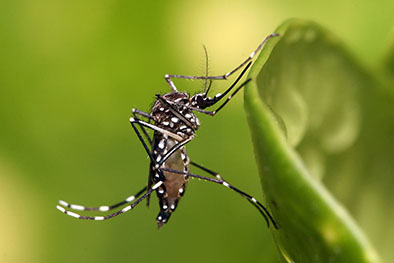

## Zika Incidence in Pan America 

 
  This page provides important information regarding the Zika virus and tools to help you better understand the prevalance of the virus throughout Pan America. Our goal is to instill the importance and awareness of this disease to our viewers and to better prepare them to prevent the contraction of the disease, both for themselves and their loved ones.

